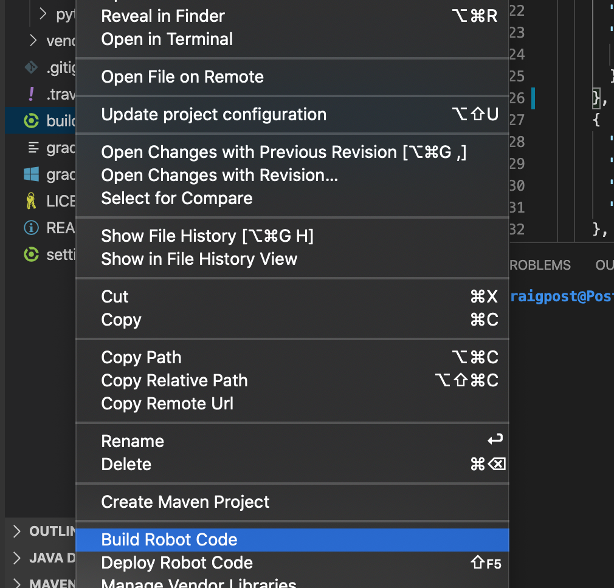
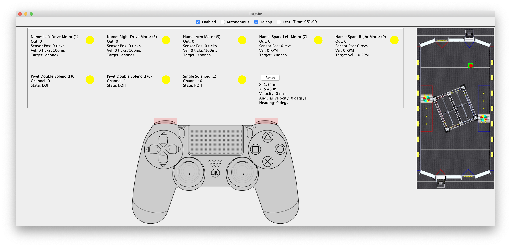

# FRCSim - A pure java simulator for FRC robots
The purpose of this project is to provide an easy to use First Robotics robot simulator. The simulator 
overrides the various HAL JNI classes used by the WPI libraries to communicate with the hardware and 
network. 

This project is in very early stages and is not currently released anywhere. 

# Caveats
Some caveats to running this simulator

- It is Java only
- It has been tested extensively with the Bit Buckets robot, but not really with other robots so if we don't need it, it hasn't been sim'd.
- It only supports CTRE and REV motors. I haven't added hooks for the regular PWM motors
- The keyboard is configured to simulate two PS4 controllers, so an xbox controller will have wonky axis and button mappings
- It's fragile. The way most of the JNIs are redefined only work if the JNI doesn't change. Any new release from WPI 
could break the sim. I have a fix for this, but haven't finished updating all JNI sims.

## Code Modules
### Robot Test Code
There are two Robot projects, one for students to learn on and one for testing simulator code.

Path | Module
--- | ---
**/** | The root module containing a teaching robot for students to modify
**/mentor-bot** | A bot for mentors to test with, because mentors need to learn to robot as well

### Simulator Modules
There are three simulator modules. The main simulator module is where the bulk of the code is. The CTRE 
and REV modules contain JNI overrides for CTRE and REV motors. If you don't need CTRE or REV motor simulation, 
you don't need these modules.

Path | Module
--- | ---
**/simulator** | The java based simulator
**/simulator-ctre** | A library for overriding the CTRE JNI 
**/simulator-rev** | A library for overriding the REV robotics JNI 

### Unity Modules
The simulator was built to be run as either a standalone java app, or as a GRPC java server that allows 
a Unity program to *hook* into robot code for more advanced simulations. This part is very much in initial stages. The 
bulk of the work has been on the java simulator.

| Path | Module |
--- | ---
**/simulator/UnitySim** | A unity based simulator that uses GRPC to talk to a java robot |
**/simulator/UnitySimProtobuf** | A simple C# project to build protobuf files for unity |

## Configure Your Robot
To configure a robot to use the simulator, add a couple lines to your build.gradle:

### build.gradle changes 
First update the repositories {} section to include this hacky github maven repo
```gradle
repositories {
    // ...
    // other maven stuff, like mavenCentral()

    maven {
        // this repo contains the FRCSim
        url 'https://raw.githubusercontent.com/cpostbitbuckets/maven_repo/master'
    }
}
```

Next, update the dependencies section to include a test dependency on FRCSim:
```gradle

dependencies {
... other dependencies
    // ADD THIS DEPENDENCY
    // we only use this project at runtime when doing simulations
    testImplementation "org.bitbuckets:simulator:2020.1.2-SNAPSHOT"

    // If you have Talon motors, use this dependency as well
    testImplementation "org.bitbuckets:simulator-ctre:2020.1.2-SNAPSHOT"

    // If you have Spark motors, use this dependency as well
    testImplementation "org.bitbuckets:simulator-rev:2020.1.2-SNAPSHOT"

}
```

**Note**: Make sure you have the nativeDesktopZip dependency and includeDesktopSupport to true. This will 
ensure you can use shuffleboard and outline viewer to view any network table entries

### Add a test Sim class
The launch the sim, create a new Sim.java file in src/test/java/frc/robot/Sim.java

```java

package frc.robot;

import frc.robot.simulator.SimMain;

import java.io.IOException;

public class Sim {
    public static void main(String[] args) throws InterruptedException, IOException {
        // start the sim
        SimMain.main(args);
    }
}

```

### vscode launch.json changes
Finally, you'll need to update your launch.json to add an additional simulator configuration:

```json
    {
      "type": "java",
      "name": "Sim - local",
      "request": "launch",
      "mainClass": "frc.robot.Sim",
      "vmArgs": "-Djava.library.path=build/tmp/jniExtractDir",
      "env": {
        "DYLD_LIBRARY_PATH": "build/tmp/jniExtractDir",
        "Path": "${env:Path};${workspaceFolder}\\build\\tmp/jniExtractDir"
      }
    }
```

### Build it and Test it
Use vs code to build the robot (and extract the network table native libraries into your build/ dir). 



Select the debug view and the newly created `SimMain - local` configuration, and click play.


**Note** You may have to run it twice. The first time it can't load native libraries, for some reason. I haven't 
figured that out yet.

You should see some hideous UI like this:


